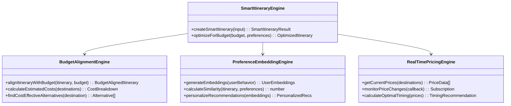

# Smart Budget System Upgrade Architecture Design

## Executive Summary

This document outlines the comprehensive architecture for upgrading the existing smart budget system in the JaTour application. The upgrade introduces advanced features including real-time expense tracking, AI-powered itinerary optimization, one-click price comparisons, auto budget correction, and enhanced analytics while maintaining full front-end compatibility and responsive design.

## Current System Analysis

### Budget System
- **Architecture**: NestJS service with Prisma ORM
- **Features**: Basic budget calculation based on itinerary duration and fixed cost estimates
- **Data Model**: Budget entity with totalBudget, spent, categories (JSON)
- **Limitations**: Static cost estimates, no real-time tracking, limited ML integration

### Expense System
- **Architecture**: NestJS service with WebSocket gateway for real-time notifications
- **Features**:
  - ML-based expense categorization (rule-based with confidence scores)
  - Anomaly detection using statistical methods
  - Real-time budget threshold alerts (70%, 90%)
  - External transaction synchronization
  - Analytics with category breakdowns and daily spending
- **Data Model**: Expense, Transaction entities with ML metadata

### ML Engines
- **MLEngine**: User behavior tracking and preference profiling
- **IntelligentBudgetEngine**: Smart budget calculations with seasonal/city multipliers
- **SmartItineraryEngine**: AI-powered itinerary optimization
- **ItineraryManagementEngine**: Advanced itinerary state management

### Itinerary Generator
- **Architecture**: Modular engine system with multiple specialized components
- **Features**: Day structure planning, cost distribution, transportation optimization, meal planning

## Proposed Architecture Overview

### System Architecture Diagram


## Detailed Feature Designs

### 1. Real-time Expense Tracking with Automatic Synchronization

#### Architecture Components
- **Expense Ingestion Service**: Handles incoming transactions from multiple sources
- **ML Categorization Engine**: Enhanced categorization with deep learning models
- **Real-time Notification System**: WebSocket-based alerts with progressive thresholds
- **Synchronization Manager**: Manages external API integrations

#### Data Flow Diagram


#### API Specifications

**POST /api/expenses/sync-transaction**
```typescript
interface SyncTransactionDto {
  userId: string;
  source: 'qris' | 'card' | 'ewallet';
  externalId: string;
  amount: number;
  currency: string;
  date: string;
  merchant?: string;
  location?: string;
  description?: string;
  consentGiven: boolean;
}

Response: Transaction
```

**GET /api/expenses/real-time**
WebSocket endpoint for real-time updates
```typescript
interface RealTimeExpenseUpdate {
  type: 'expense_created' | 'budget_threshold' | 'sync_completed';
  data: Expense | BudgetAlert | Transaction;
  timestamp: Date;
}
```

#### Integration Points
- Existing ExpenseService.categorizeExpense() - enhance with ML models
- ExpensesGateway - extend for progressive notifications
- Add new SyncManager for external API polling

### 2. AI Itinerary Optimizer with Budget Alignment

#### Architecture Components
- **Budget-Aligned Itinerary Engine**: Extends SmartItineraryEngine
- **Cost Estimation Service**: Real-time pricing integration
- **Preference Embedding System**: User behavior-based recommendations
- **Optimization Scheduler**: Dynamic itinerary adjustments

#### Component Diagram


#### API Specifications

**POST /api/itinerary/optimize-budget**
```typescript
interface BudgetOptimizationRequest {
  itineraryId: string;
  budgetConstraints: BudgetConstraints;
  userPreferences: UserPreferences;
  optimizationGoals: 'cost' | 'experience' | 'balanced';
}

interface BudgetConstraints {
  totalBudget: number;
  categoryLimits: Record<string, number>;
  dailyLimits: number;
  currency: string;
}

Response: OptimizedItinerary
```

### 3. One-Click Price Comparison Tools

#### Architecture Components
- **Price Aggregation Service**: Multi-source price collection
- **Comparison Engine**: Intelligent price matching and ranking
- **Real-time Update System**: Price monitoring and alerts
- **Booking Integration**: Direct booking capabilities

#### Data Flow Diagram


#### API Specifications

**GET /api/comparison/hotels**
```typescript
interface HotelComparisonRequest {
  location: string;
  checkIn: Date;
  checkOut: Date;
  guests: number;
  budget?: number;
  preferences?: HotelPreferences;
}

Response: HotelComparisonResult[]
```

### 4. Auto Budget Correction System

#### Architecture Components
- **Spending Pattern Analyzer**: ML-based pattern recognition
- **Budget Adjustment Engine**: Automatic plan modifications
- **Preference Learning System**: User behavior adaptation
- **Correction Notification System**: Proactive alerts and suggestions

#### Component Diagram


### 5. Personalized Spending Insights and Analytics

#### Architecture Components
- **Advanced Analytics Engine**: Deep spending analysis
- **Insight Generation Service**: AI-powered recommendations
- **Visualization System**: Interactive dashboards
- **Savings Opportunity Detector**: Automated savings identification

#### API Specifications

**GET /api/analytics/insights/{userId}**
```typescript
interface SpendingInsightsRequest {
  period: 'week' | 'month' | 'quarter' | 'year';
  categories?: string[];
  compareWith?: 'previous' | 'average' | 'peers';
}

Response: SpendingInsights
```

### 6. Smart Trip Goals with Auto-Adjusting Recommendations

#### Architecture Components
- **Goal Management Engine**: Dynamic goal setting and tracking
- **Recommendation Adjustment System**: ML-based personalization
- **Progress Tracking Service**: Real-time goal monitoring
- **Adaptive Planning Engine**: Automatic itinerary modifications

### 7. Budget-as-a-Plan (BaaP) with 95% Adherence Guarantee

#### Architecture Components
- **Adherence Prediction Engine**: ML-based success probability calculation
- **Plan Optimization Service**: Guarantee-backed planning
- **Risk Assessment System**: Failure point identification
- **Contingency Planning Engine**: Backup strategies

### 8. Enhanced Budget Dashboard with Per-Day Burn Rates

#### Architecture Components
- **Burn Rate Calculator**: Real-time spending velocity analysis
- **Dashboard Aggregation Service**: Multi-source data integration
- **Visualization Engine**: Interactive charts and graphs
- **Alert System**: Proactive burn rate warnings

### 9. Trip Budget Matching Deals System

#### Architecture Components
- **Deal Matching Engine**: Budget-constrained deal identification
- **Merchant Integration Service**: Partner deal aggregation
- **Relevance Scoring System**: Budget alignment calculation
- **Deal Notification System**: Targeted deal alerts

### 10. Mall/Area Deal Maps with Interactive Interfaces

#### Architecture Components
- **Geospatial Deal Engine**: Location-based deal mapping
- **Interactive Map Service**: Real-time deal visualization
- **Color-coded Indicator System**: Budget-based deal prioritization
- **Dynamic Deal Updates**: Real-time deal information

## Technical Specifications

### Database Schema Extensions

```sql
-- Enhanced Budget Table
ALTER TABLE Budget ADD COLUMN
  adherenceTarget DECIMAL(5,2) DEFAULT 95.00,
  autoCorrectionEnabled BOOLEAN DEFAULT true,
  lastCorrectionDate TIMESTAMP,
  correctionHistory JSONB;

-- New Tables
CREATE TABLE BudgetCorrections (
  id SERIAL PRIMARY KEY,
  budgetId VARCHAR REFERENCES Budget(id),
  correctionType VARCHAR,
  adjustments JSONB,
  appliedAt TIMESTAMP DEFAULT NOW(),
  success BOOLEAN
);

CREATE TABLE DealMatches (
  id SERIAL PRIMARY KEY,
  userId VARCHAR,
  budgetId VARCHAR REFERENCES Budget(id),
  merchantId VARCHAR,
  dealData JSONB,
  relevanceScore DECIMAL(3,2),
  matchedAt TIMESTAMP DEFAULT NOW()
);

CREATE TABLE PriceComparisons (
  id SERIAL PRIMARY KEY,
  userId VARCHAR,
  category VARCHAR,
  searchCriteria JSONB,
  results JSONB,
  createdAt TIMESTAMP DEFAULT NOW()
);
```

### API Integration Points

#### Existing System Integration
- Extend ExpenseService for enhanced ML categorization
- Integrate with existing WebSocket gateway for real-time features
- Leverage MLEngine for user behavior analysis
- Connect with SmartItineraryEngine for budget-aligned planning

#### New External API Integrations
- QRIS payment gateways for transaction sync
- Banking APIs for card transaction import
- Hotel booking APIs (Agoda, Booking.com)
- Transportation APIs (Grab, Gojek, local transit)
- Deal aggregator APIs (merchant partnerships)

### Performance Requirements

- **Real-time Processing**: <100ms for expense categorization
- **Sync Latency**: <5 seconds for external transaction import
- **Dashboard Load Time**: <2 seconds for analytics rendering
- **Concurrent Users**: Support 10,000+ simultaneous connections
- **Data Retention**: 7 years for financial data compliance

### Security Considerations

- **Data Encryption**: End-to-end encryption for financial data
- **Consent Management**: Granular user consent for data sharing
- **Audit Logging**: Complete transaction audit trails
- **Fraud Detection**: ML-based anomaly detection for suspicious activities
- **API Rate Limiting**: Protection against abuse and DoS attacks

### Scalability Design

- **Microservices Architecture**: Independent scaling of services
- **Event-Driven Processing**: Asynchronous processing for heavy computations
- **Caching Strategy**: Redis for frequently accessed data
- **Load Balancing**: Horizontal scaling support
- **Database Sharding**: User-based data partitioning

## Implementation Roadmap

### Phase 1: Foundation (Weeks 1-4)
- Enhance expense categorization with advanced ML
- Implement real-time synchronization framework
- Extend WebSocket gateway for progressive notifications

### Phase 2: AI Features (Weeks 5-8)
- Develop AI itinerary optimizer with budget alignment
- Implement preference embedding system
- Create auto budget correction engine

### Phase 3: Price & Deal Integration (Weeks 9-12)
- Build one-click price comparison tools
- Implement deal matching system
- Create interactive deal maps

### Phase 4: Analytics & Insights (Weeks 13-16)
- Develop personalized spending insights
- Implement enhanced dashboard with burn rates
- Create smart trip goals system

### Phase 5: Advanced Features (Weeks 17-20)
- Implement BaaP with adherence guarantee
- Add predictive analytics and recommendations
- Performance optimization and testing

## Risk Assessment & Mitigation

### Technical Risks
- **ML Model Accuracy**: Implement fallback rule-based systems
- **External API Reliability**: Circuit breaker patterns and caching
- **Real-time Performance**: Optimize WebSocket connections and data structures

### Business Risks
- **User Adoption**: Gradual feature rollout with user feedback
- **Data Privacy**: Comprehensive consent and GDPR compliance
- **Integration Complexity**: Phased implementation with testing

### Operational Risks
- **System Downtime**: Redundant architecture and failover systems
- **Data Loss**: Regular backups and disaster recovery
- **Security Breaches**: Multi-layer security and monitoring

## Conclusion

This architecture provides a comprehensive upgrade path for the smart budget system, introducing advanced AI capabilities while maintaining system stability and user experience. The modular design allows for incremental implementation and testing, ensuring minimal disruption to existing functionality.

The design focuses on real-time capabilities, intelligent automation, and personalized experiences that will significantly enhance the value proposition of the JaTour platform.